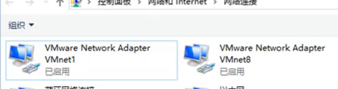
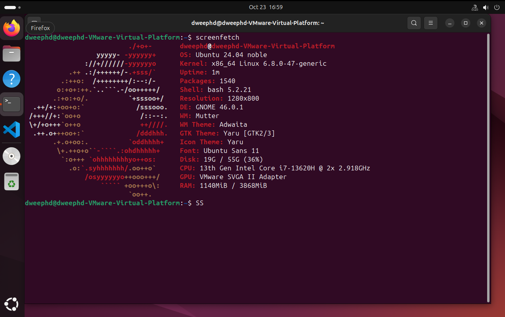

# My Linux Setup

### 创建虚拟机的硬件条件：
- CPU：i5/i7以上
- 内存：8G
- 硬盘：固态硬盘
如果配置太低运行虚拟机时会比较卡顿
# 一、安装VMWare软件
前往官网下载并安装VMWare 17 Pro软件，链接:https://www.vmware.com/ 
1. 进入官网后点击右上角LOGIN->Broadcom Support
2. 注册并登录后在BROADCOM首页右上角依次点击Software -> VMware Cloud Foudation -> MyDownloads，在右上角搜索框搜索VMware Workstation Pro
3. 点击VMware Workstation Pro for Personal Use，下载最新版本

安装完成后，在 控制面板|网络与共享中心|更改适配器设置 里，查看是否已经添加了2个虚拟网卡：VMnet1，VMnet8，如果没有的话需要卸载，再重新右键以管理员身份运行安装


# 二、创建虚拟机
1. 启动VMWare，点击创建新的虚拟机
2. 典型 -> 下一步 -> 稍候安装操作系统 -> Linux -> 版本（V）Ubuntu 64 位 -> 下一步 -> 自定义虚拟机保存的位置（建议该目录在固态硬盘分区上） -> 将虚拟机存储成单个文件 -> 下一步 -> 完成

现在有两个主机；
-  宿主机：Windows 11
-  虚拟机：裸机，即将安装 Ubuntu

# 三、下载Ubuntu系统映像
1. 前往官网：https://ubuntu.com/download
2. 点击 Download Ubuntu Desktop 下载个人桌面版本，安装包为ISO格式

# 四、设置ISO映像
1. 在VMware 中找到刚刚下载的虚拟机，点击编辑虚拟机设置
2. 点击CD/DVD（SATA），设备状态更改为启动时连接，连接方式改为使用ISO映像文件，将刚刚下载的ISO文件勾选进去
3. 其他保持默认，点击确定

# 五、安装Ubuntu系统
安装过程中，宿主机必须保持联网。
1. 点击开启虚拟机，安装过程启动
2. 鼠标点进去，虚拟机会捕获鼠标和键盘的输入。按键盘的上箭头，移动到Install Centos Linux 上，点回车键开始安装
- *提示：按Ctrl+Alt虚拟机释放鼠标，回到主系统*
3. 安装引导时可全部默认，选语言时最好选择英文
4. 安装完成，重启虚拟机，重启之后，鼠标进去点回车，进入Ubuntu系统

- *如果Ubuntu有问题，可以直接删除目录然后重装*

5. 进入Terminal,输入sudo install screenfetch
```
sudo install screenfetch
```
再输入
```
screenfetch
```



# 六、简单Linux配置
### Vim
[Vim](https://manual.caiyi1.me/use-vim/install/)
### Rust和VScode
[Rust和VScode](https://opencamp.cn/os2edu/camp/2024fall/stage/1?tab=video)